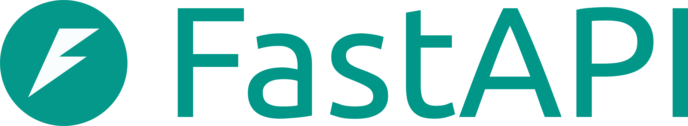

  

  
  

---

## 🏗️ About Me  
I’m **Lokmane Akkouh**, final-year Data Engineering & Data Science student at ENSA Al Hoceima, currently interning at STM (Tanger-Tétouan). I architect **Kafka + Debezium** CDC pipelines for a city-wide smart-parking solution, automate ETL with Airflow, and containerize everything with Docker. Off-hours you’ll find me debugging Data Bricks or perfecting my mint **atay**.

---

## 📫 Contact  
- 📱 +212 642-609 327  
- ✉️ lokmaneakkouh10@gmail.com  
- 🔗 [LinkedIn](https://www.linkedin.com/in/lokmane-akkouh)  
- 🐦 [Twitter/@lokmane_dev](https://twitter.com/lokmane_dev)

---

## 🛠️ Core Skills & Tools  

  
  
  
  
  
  
  
  
  
  
  
  
  
  
  
  
  
  

---

## 📜 Certifications & Languages  
- **Big Data with Spark & Hadoop Essentials**  
- **Machine Learning with Apache Spark**  
- **Talend Data Integration**  
- **AWS Certified Cloud Practitioner**  
- 🗣️ Arabic (native), English (fluent), French (fluent)

---

## 💼 Professional Experience  
**Data Engineer Intern @ ShiftBricks**  
_Jul 2024 – Sep 2024 (3 mo.)_  
- Built an end-to-end **AI document ingestion pipeline**: OCR + LLM to extract legal texts, store in MongoDB with embeddings.  
- Automated human-in-the-loop validation via Airflow + FARM stack UI.  
- Containerized app with Docker & deployed to Azure Container Registry.  

---

## 🎓 Academic Projects  
**Agricultural Patent Analytics**  
- Processed patent datasets with Spark & MongoDB Atlas → centralized PostgreSQL DW.  
- Built interactive Power BI dashboards for researchers & investors.

**Laptop Price Prediction (ML)**  
- Collected e-commerce data, engineered features, trained regression models.  
- Deployed real-time prediction UI with Streamlit.

**Customer Feedback Intelligence**  
- Ingested Google Form surveys, applied DAX measures in Power BI.  
- Designed KPI tracking dashboards for executive decision-making.

**CI/CD Pipeline on Azure**  
- Automated React app build/test/deploy to Azure App Service via Azure DevOps.  
- Used Docker + ACR for container orchestration and scaling.

---

## 🚀 Featured Open-Source Projects  
- **Smart Parking Platform** &mdash; Kafka • Debezium • FastAPI • React  
- **CleanETL Framework** &mdash; Python • Pandas • Airflow  
- **Dashboard Templates** &mdash; Metabase • Power BI

---

  
  <em>“If it’s not automated, it’s not optimized.”</em>  

